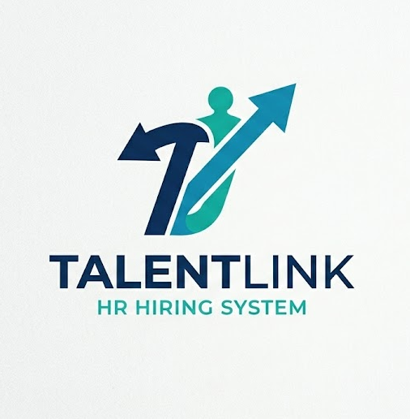

# TalentLink - AI-Powered HR Hiring System

<div align="center">



**An intelligent hiring platform that automates candidate evaluation using AI**

[](https://dotnet.microsoft.com/)
[](https://angular.io/)
[](https://python.org/)
[](https://docker.com/)
[](https://ai.google.dev/)

</div>

---

## 📋 Table of Contents

- [Overview](#-overview)
- [Features](#-features)
- [Architecture](#-architecture)
- [Tech Stack](#-tech-stack)
- [Prerequisites](#-prerequisites)
- [Quick Start](#-quick-start)
- [Environment Variables](#-environment-variables)
- [Project Structure](#-project-structure)
- [API Documentation](#-api-documentation)
- [AI Evaluation Pipeline](#-ai-evaluation-pipeline)
- [Development Setup](#-development-setup)
- [Screenshots](#-screenshots)
- [Contributing](#-contributing)
- [License](#-license)

---

## 🎯 Overview

**TalentLink** is a full-stack AI-powered hiring management system designed to streamline the recruitment process. The platform automates CV parsing, candidate evaluation, and interview question generation using Google's Gemini AI, significantly reducing manual HR workload while ensuring consistent and unbiased candidate assessments.

### Why TalentLink?

- **Save Time**: Automated CV screening reduces evaluation time from hours to seconds
- **Consistency**: AI-driven scoring ensures every candidate is evaluated equally
- **Smart Questions**: Generated interview questions tailored to each candidate's profile
- **Self-Validation**: Built-in reflection mechanism ensures evaluation accuracy

---

## ✨ Features

### For Candidates
- 📝 Browse and search job listings
- 📤 Apply with CV upload (PDF format)
- 📧 Track application status

### For HR Managers
- 📊 Dashboard with application overview
- 🤖 AI-generated evaluation reports
- 📈 Skills match visualization
- ❓ Tailored interview questions with expected answers
- ✅ Accept/Reject/Review workflow

### For Administrators
- 👥 User management (CRUD operations)
- 🔐 Role-based access control (Admin, HR, Candidate)
- 📋 Job posting management

### AI-Powered Evaluation
- 🔍 Automated CV parsing and text extraction
- 🎯 Skills matching against job requirements
- 🎓 Education verification
- 💼 Experience analysis
- 📊 Weighted scoring (Skills 40%, Education 30%, Experience 30%)
- 🔄 Self-reflection for result validation
- ❓ 20 interview questions with expected answers

---

## 🏗 Architecture

```
┌─────────────────────────────────────────────────────────────────────────────┐
│                           TalentLink Architecture                            │
├─────────────────────────────────────────────────────────────────────────────┤
│                                                                              │
│  ┌──────────────┐    ┌──────────────┐    ┌──────────────┐                   │
│  │   Candidate  │    │  HR Manager  │    │    Admin     │                   │
│  └──────┬───────┘    └──────┬───────┘    └──────┬───────┘                   │
│         │                   │                   │                           │
│         └───────────────────┼───────────────────┘                           │
│                             ▼                                               │
│  ┌──────────────────────────────────────────────────────────────────────┐   │
│  │                    Angular 18 + Bootstrap 5                          │   │
│  │                         (nginx container)                            │   │
│  └──────────────────────────────────────────────────────────────────────┘   │
│                             │                                               │
│                             ▼                                               │
│  ┌──────────────────────────────────────────────────────────────────────┐   │
│  │                      .NET 10 Web API                                 │   │
│  │                   (Clean Architecture)                               │   │
│  ├──────────────────────────────────────────────────────────────────────┤   │
│  │  Controllers → Handlers → Validators → Repositories → Services      │   │
│  └──────────────────────────────────────────────────────────────────────┘   │
│                             │                                               │
│         ┌───────────────────┼───────────────────┐                           │
│         ▼                   ▼                   ▼                           │
│  ┌────────────┐     ┌────────────┐      ┌────────────┐                      │
│  │ SQL Server │     │  MongoDB   │      │   Redis    │                      │
│  │   2022     │     │     7      │      │     7      │                      │
│  │            │     │            │      │            │                      │
│  │ Jobs,Users │     │ Evaluation │      │ JWT Token  │                      │
│  │ Candidates │     │  Reports   │      │   Cache    │                      │
│  └────────────┘     └────────────┘      └────────────┘                      │
│                                                                              │
│  ┌──────────────────────────────────────────────────────────────────────┐   │
│  │                   Azure Functions (Queue Trigger)                    │   │
│  └──────────────────────────────────────────────────────────────────────┘   │
│                             │                                               │
│                             ▼                                               │
│  ┌──────────────────────────────────────────────────────────────────────┐   │
│  │                    Python FastAPI AI Agent                           │   │
│  ├──────────────────────────────────────────────────────────────────────┤   │
│  │  CV Parser │ Skill Extractor │ Scorer │ Reflector │ Q&A Generator   │   │
│  └──────────────────────────────────────────────────────────────────────┘   │
│                             │                                               │
│                             ▼                                               │
│  ┌──────────────────────────────────────────────────────────────────────┐   │
│  │                      Google Gemini API                               │   │
│  │                     (gemma-3-27b-it model)                           │   │
│  └──────────────────────────────────────────────────────────────────────┘   │
│                                                                              │
└─────────────────────────────────────────────────────────────────────────────┘
```

For detailed architecture diagrams, see [architecture.mmd](architecture.mmd).

---

## 🛠 Tech Stack

### Frontend
| Technology | Version | Purpose |
|------------|---------|---------|
| Angular | 18 | SPA Framework |
| TypeScript | 5.x | Type-safe JavaScript |
| Bootstrap | 5 | UI Components |
| RxJS | 7.x | Reactive Programming |
| nginx | latest | Production Web Server |

### Backend API
| Technology | Version | Purpose |
|------------|---------|---------|
| .NET | 10.0 | API Framework |
| C# | 13 | Programming Language |
| Entity Framework Core | 9.x | SQL ORM |
| MongoDB.Driver | 3.x | NoSQL Client |
| StackExchange.Redis | 2.x | Caching Client |
| FluentValidation | 11.x | Request Validation |

### AI Agent
| Technology | Version | Purpose |
|------------|---------|---------|
| Python | 3.11 | Runtime |
| FastAPI | 0.115+ | API Framework |
| Pydantic | 2.x | Data Validation |
| PyMuPDF4LLM | 0.0.17 | PDF Text Extraction |
| google-generativeai | 0.8+ | Gemini SDK |
| httpx | 0.28+ | Async HTTP Client |

### Infrastructure
| Technology | Version | Purpose |
|------------|---------|---------|
| Docker | 24+ | Containerization |
| Docker Compose | 2.x | Multi-container Orchestration |
| SQL Server | 2022 | Relational Database |
| MongoDB | 7 | Document Database |
| Redis | 7 | Token Cache |
| Azurite | latest | Local Blob Storage |
| Azure Functions | 4.x | Queue Processing |

### AI/ML
| Technology | Model | Purpose |
|------------|-------|---------|
| Google Gemini API | gemma-3-27b-it | LLM for Evaluation |

---

## 📦 Prerequisites

Before running TalentLink, ensure you have:

- **Docker Desktop** (v24+) with Docker Compose v2
- **Git** for cloning the repository
- **Google AI Studio API Key** - [Get one free](https://ai.google.dev/)
- Minimum **8GB RAM** recommended
- **20GB free disk space** for containers and databases

---

## 🚀 Quick Start

### 1. Clone the Repository

```bash
git clone https://github.com/yourusername/TalentLink.git
cd TalentLink
```

### 2. Configure Environment Variables

Create a `.env` file in the root directory:

```bash
# Database
SQL_SA_PASSWORD=YourStrong@Password123!

# JWT Authentication
JWT_KEY=your-256-bit-secret-key-here-min-32-characters
JWT_ISSUER=HRHiringSystem.API
JWT_AUDIENCE=HRHiringSystem.Client
JWT_EXPIRES_MINUTES=60

# Azure Blob Storage (for local dev, use Azurite)
AZURE_BLOB_CONNECTION_STRING=DefaultEndpointsProtocol=http;AccountName=devstoreaccount1;AccountKey=Eby8vdM02xNOcqFlqUwJPLlmEtlCDXJ1OUzFT50uSRZ6IFsuFq2UVErCz4I6tq/K1SZFPTOtr/KBHBeksoGMGw==;BlobEndpoint=http://localhost:10000/devstoreaccount1;

# Google Gemini AI (REQUIRED)
GEMINI_API_KEY=your-gemini-api-key-from-google-ai-studio
GEMINI_MODEL=gemma-3-27b-it

# Azure Functions
FUNCTION_API_KEY=your-random-secret-key-for-functions
```

### 3. Start All Services

```bash
docker compose up --build -d
```

This will start:
- **web** → http://localhost:4200 (Angular Frontend)
- **api** → http://localhost:8080 (NET API)
- **ai-agent** → http://localhost:8001 (Python AI Agent)
- **functions** → http://localhost:7071 (Azure Functions)
- **sqlserver** → localhost:1434 (SQL Server)
- **mongodb** → localhost:27018 (MongoDB)
- **redis** → localhost:6379 (Redis)
- **azurite** → localhost:10000-10002 (Blob Storage)

### 4. Access the Application

Open your browser and navigate to:

- **Frontend**: http://localhost:4200
- **API Swagger**: http://localhost:8080/swagger
- **AI Agent Docs**: http://localhost:8001/docs

### 5. Default Admin Credentials

```
Email: admin@talentlink.com
Password: Admin@123!
```

---

## 🔐 Environment Variables

### Required Variables

| Variable | Description | Example |
|----------|-------------|---------|
| `SQL_SA_PASSWORD` | SQL Server SA password (min 8 chars, uppercase, lowercase, number) | `YourStrong@123` |
| `JWT_KEY` | JWT signing key (min 32 characters) | `your-256-bit-secret...` |
| `JWT_ISSUER` | JWT token issuer | `HRHiringSystem.API` |
| `JWT_AUDIENCE` | JWT token audience | `HRHiringSystem.Client` |
| `GEMINI_API_KEY` | Google Gemini API key | `AIzaSy...` |

### Optional Variables

| Variable | Description | Default |
|----------|-------------|---------|
| `JWT_EXPIRES_MINUTES` | Token expiration time | `60` |
| `GEMINI_MODEL` | Gemini model to use | `gemma-3-27b-it` |
| `FUNCTION_API_KEY` | Shared key for function auth | Random string |

---

## 📁 Project Structure

```
TalentLink/
├── docker-compose.yml          # Multi-container orchestration
├── architecture.mmd            # Mermaid architecture diagrams
├── .env                        # Environment variables (git-ignored)
├── HRHiringSystem.sln         # .NET Solution file
│
├── HRHiringSystem.API/         # .NET 10 Web API
│   ├── Controllers/            # HTTP endpoints
│   ├── Middleware/             # Exception handling
│   ├── Program.cs              # Entry point & DI setup
│   └── Dockerfile
│
├── HRHiringSystem.Application/ # Application layer
│   ├── Handlers/               # Business logic handlers
│   ├── Validators/             # FluentValidation rules
│   ├── Requests/               # Input DTOs
│   ├── Responses/              # Output DTOs
│   ├── Mappings/               # AutoMapper profiles
│   └── Interfaces/             # Abstractions
│
├── HRHiringSystem.Domain/      # Domain layer
│   ├── Entities/               # Database entities
│   ├── Enums/                  # Status enumerations
│   └── Models/                 # Domain models
│
├── HRHiringSystem.Infrastructure/ # Infrastructure layer
│   ├── Data/                   # EF DbContext
│   ├── Repositories/           # Data access
│   ├── Services/               # External services
│   ├── Migrations/             # EF Migrations
│   └── Storage/                # Blob storage
│
├── HRHiringSystem.AIAgent/     # Python FastAPI AI Agent
│   ├── app/
│   │   ├── main.py             # FastAPI entry
│   │   ├── agents/             # Hiring agent orchestrator
│   │   ├── tools/              # AI tools (parser, scorer, etc.)
│   │   ├── services/           # External API clients
│   │   └── schemas/            # Pydantic models
│   ├── requirements.txt
│   └── Dockerfile
│
├── HRHiringSystem.Functions/   # Azure Functions
│   ├── function_app.py         # Queue trigger handler
│   └── Dockerfile
│
└── HRHiringSystem.Web/         # Angular 18 Frontend
    ├── src/
    │   ├── app/
    │   │   ├── components/     # UI components
    │   │   ├── services/       # API services
    │   │   ├── guards/         # Route guards
    │   │   └── models/         # TypeScript interfaces
    │   └── environments/       # Config files
    ├── nginx.conf              # Production server config
    └── Dockerfile
```

---

## 📡 API Documentation

### Authentication

| Endpoint | Method | Description |
|----------|--------|-------------|
| `/api/auth/register` | POST | Register new user |
| `/api/auth/login` | POST | Login and get JWT |
| `/api/auth/me` | GET | Get current user info |

### Jobs

| Endpoint | Method | Auth | Description |
|----------|--------|------|-------------|
| `/api/jobs` | GET | - | List all jobs |
| `/api/jobs/{id}` | GET | - | Get job details |
| `/api/jobs` | POST | HR/Admin | Create job |
| `/api/jobs/{id}` | PUT | HR/Admin | Update job |
| `/api/jobs/{id}` | DELETE | Admin | Delete job |

### Applications

| Endpoint | Method | Auth | Description |
|----------|--------|------|-------------|
| `/api/applications` | POST | Candidate | Apply for job |
| `/api/applications/job/{jobId}` | GET | HR/Admin | List job applications |
| `/api/applications/{id}/status` | PATCH | HR/Admin | Update status |

### Evaluation Reports

| Endpoint | Method | Auth | Description |
|----------|--------|------|-------------|
| `/api/reports/job/{jobId}` | GET | HR/Admin | List job reports |
| `/api/reports/job/{jobId}/report/{reportId}` | GET | HR/Admin | Get report details |

### Users & Roles

| Endpoint | Method | Auth | Description |
|----------|--------|------|-------------|
| `/api/users` | GET | Admin | List users |
| `/api/users/{id}` | GET | Admin | Get user |
| `/api/roles` | GET | Admin | List roles |

---

## 🤖 AI Evaluation Pipeline

When a candidate applies:

1. **CV Upload** → Stored in Azurite Blob Storage
2. **Queue Trigger** → Azure Function triggered
3. **AI Agent** receives evaluation request
4. **CV Parsing** → PyMuPDF4LLM extracts text
5. **Skill Extraction** → LLM identifies skills from CV and job
6. **Analysis** → Education, Experience, Skills scored
7. **Total Score** → Weighted calculation:
   - Skills Match: **40%**
   - Education: **30%**
   - Experience: **30%**
8. **Reflection** → AI validates its own analysis (up to 2 iterations)
9. **Status Decision**:
   - Score ≥ 80: **Accepted** ✅
   - Score 65-79: **HR Review** ⚬
   - Score < 65: **Rejected** ❌
10. **Interview Questions** → 20 questions with expected answers (if not rejected)
11. **Save Report** → MongoDB stores full evaluation

---

## 💻 Development Setup

### Running Individual Services

#### API (.NET)

```bash
cd HRHiringSystem.API
dotnet restore
dotnet run
```

#### AI Agent (Python)

```bash
cd HRHiringSystem.AIAgent
python -m venv venv
.\venv\Scripts\activate  # Windows
source venv/bin/activate # Linux/Mac
pip install -r requirements.txt
uvicorn app.main:app --host 0.0.0.0 --port 8001 --reload
```

#### Frontend (Angular)

```bash
cd HRHiringSystem.Web
npm install
ng serve
```

### Database Connections

**SQL Server** (SSMS/Azure Data Studio):
```
Server: localhost,1434
User: sa
Password: (from .env)
```

**MongoDB** (MongoDB Compass):
```
mongodb://localhost:27018
```

**Redis** (Redis CLI):
```bash
redis-cli -h localhost -p 6379
```

---

## 📸 Screenshots

### Candidate Portal
- Job listings with search and filters
- Application form with CV upload

### HR Dashboard  
- Application list with status badges
- Detailed evaluation report view
- Interview questions panel

### Admin Panel
- User management grid
- Role assignment

---

## 🤝 Contributing

We welcome contributions! Please follow these steps:

1. Fork the repository
2. Create a feature branch (`git checkout -b feature/amazing-feature`)
3. Commit changes (`git commit -m 'Add amazing feature'`)
4. Push to branch (`git push origin feature/amazing-feature`)
5. Open a Pull Request

### Code Standards

- **C#**: Follow Microsoft C# coding conventions
- **Python**: Follow PEP 8, use type hints
- **TypeScript**: Use strict mode, follow Angular style guide
- **Commits**: Use conventional commits format

---

## 📝 License

This project is licensed under the MIT License - see the [LICENSE](LICENSE) file for details.

---

## 👨‍💻 Author

**Waqar Ahmad**  
Ciklum AI Academy - Level 3 Engineering Capstone  
March 2026

---

<div align="center">

**[⬆ Back to Top](#talentlink---ai-powered-hr-hiring-system)**

Made with ❤️ using Angular, .NET, Python, and Google Gemini AI

</div>
